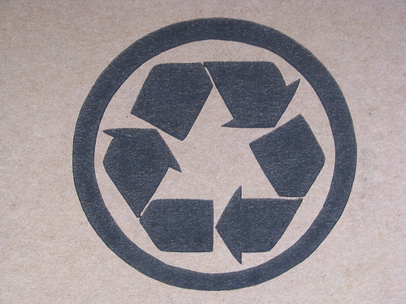

!SLIDE center

# Ecosystem #

!SLIDE bullets incremental

* `npm(1)` - node package manager
* `express` - Sinatra inspired web framework
* `connect` - Rack inspired middleware
* `CoffeeScript` - Python/Ruby language
* `query(1)` - Commandline scraping

!SLIDE commandline incremental

# `npm(1)`

    $ npm install express
    npm info it worked if it ends with ok
    npm info using npm@0.2.12-1
    npm info using node@v0.4.0
    ...
    npm ok
    $ npm update
    ...

!SLIDE

# express/connect

    @@@javascript
    var express = require("express");

    var app = express.createServer();

    // Middleware (proxies to connect)
    app.use(express.logger());

    app.get("/", function(req, res) {
      res.send("Hello world");
    });

    app.listen(3000);

!SLIDE

# CoffeeScript

    @@@javascript
    express = require "express"

    app = express.createServer()

    app.use express.logger()

    app.get "/", (req, res) ->
      res.send "Hello world"

    app.listen 3000

!SLIDE commandline incremental smaller

# `query(1)`

    $ curl -s twitter.com/hecticjeff | query '#timeline .latest-status .entry-content' text
    `rake spec && git push && cap deploy` #FTW
